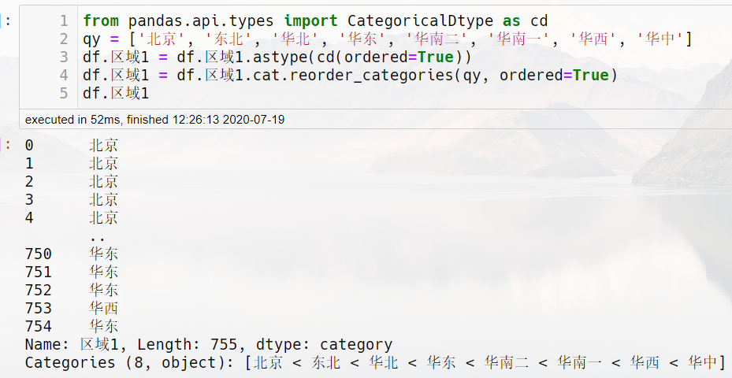

# Pandas学习笔记

1. [Pandas学习笔记](#pandas学习笔记)
   1. [使用`for`循环遍历所有元素](#使用for循环遍历所有元素)
   2. [`at`与`loc`](#at与loc)
   3. [`align`](#align)
   4. [`at`与`iat`,`loc`与`iloc`](#at与iatloc与iloc)
   5. [`pd.isna()`](#pdisna)
   6. [`category`数据类型存在的意义](#category数据类型存在的意义)
   7. [`coalesce`](#coalesce)
   8. [`CategoricalDtype`](#categoricaldtype)
   9. [`to_frame(name=name)`](#to_framenamename)
   10. [`as_type`](#as_type)
   11. [`rename`](#rename)
   12. [`reindx`](#reindx)
   13. [`drop`](#drop)
   14. [`merge`](#merge)
   15. [`join`](#join)
   16. [`concat`](#concat)
   17. [`any`](#any)
   18. [`all`](#all)
   19. [`transform`](#transform)
   20. [`applymap`](#applymap)
   21. [`agg`](#agg)
   22. [`apply`](#apply)
   23. [`pipe`](#pipe)
   24. [`applymap`与`apply`](#applymap与apply)
   25. [`agg`与`apply`](#agg与apply)
   26. [`apply`,`applymap`,`agg`,`transform`,`pipe`](#applyapplymapaggtransformpipe)
   27. [`query`](#query)
   28. [`assign`](#assign)
   29. [`eval`](#eval)
   30. [`explode`](#explode)
   31. [多级索引的显示方法](#多级索引的显示方法)
   32. [Pandas 1.1.4对于astype的修复](#pandas-114对于astype的修复)
   33. [Pandas_FAQ](#pandas_faq)

## 使用`for`循环遍历所有元素

```Python
    for i in df.index:
        for j in df.column:
```

## `at`与`loc`

at只能作用于一个值的修改，loc可以修改多值。如果只要访问单个元素，at比loc速度更快，应该优先选择at而不是loc。

## `align`

作用是将2个dataframe根据列或者行索引进行对齐,保证列或者行的索引数是一致的

## `at`与`iat`,`loc`与`iloc`

已i开头使用整数索引，第一行，第一列就是[0,0]。不以i开头的通过索引值和列标签来获取值。

## `pd.isna()`

用于检测空值最佳的选择，它会根据输入返回bool值来确定是否为空。

## `category`数据类型存在的意义

* 比字符串类型节省内存。
* 可以自定义排序规则。
* 对于其它的Python数据科学库，category数据类型将自动被识别为统计学意义上分类变量，这将有利于做数据分析。

## `coalesce`

合并多列的值为一列,可以就地修改在首列,也可以重命名新列,合并逻辑(第一列为空的用后面的列填补)

## `CategoricalDtype`

可以将分类变量数据转为categoriceldtype类型,可以设置该列的内部顺序,可以重新自定义顺序.


## `to_frame(name=name)`

可以将series转换为一个数据框,然后通过name设置列名

## `as_type`

将数据类型进行转换

```Python
df.column_name = df.column_name.astype("type")
```

## `rename`

改变列或行的名称

```Python
df.rename(columns/index=)
```

## `reindx`

修改列或者索引顺序

```Python
# 让df的column顺序设置为cols的顺序
cols = ["A","B","C"]
df = df.reindex(columns=cols)

# 让df的index设置为cols的顺序
df=df.reindex(index = cols)
```

## `drop`

删除行或者列

```Python
df.drop(columns/index=)
```

## `merge`

多表连接的方法，可以内连接、外连接。可以根据列名连接，也可以根据索引连接。

## `join`

多表连接的方法，只根据索引进行连接。

## `concat`

多表拼接，横向或者纵向拼接，可以指定是内连接还是外连接。

## `any`

根据一列或者一行布尔值返回一个布尔值结果，如果该值的列表里面只要存在一个`True`，结果就是`True`，反之返回`False`

## `all`

根据一列或者一行布尔值返回一个布尔值结果，如果该值的列表里面只要存在一个`False`，结果就是`False`，反之返回`True`

## `transform`

沿着特定轴的特定索引对df做函数映射变换，通常使用是对df的特定列做函数映射变换，返回相同形状映射后的结果列。

## `applymap`

对整个dataframe所有的元素做函数映射操作，返回映射后相同形状，相同行和列索引的dataframe。

## `agg`

沿着行或者列对dataframe做聚合函数操作，将特定行或者特定列向量聚合到标量结果，比如对一列计算平均值，对一列计数。

## `apply`

1. 沿着行或者列对dataframe做特定函数操作，当使用的是聚合类型的函数就和agg的效果一样。
2. 当使用的函数是可以对所有元素做操作的，类似于applymap。
3. 当指定特定列做apply操作，类似于transfrom。
4. 也可以对整个df做各种自定义操作（比如取得df根据某种排序规则的前几行），这一点对于需要先分组在apply的df比较有用。

## `pipe`

当你需要对一个dataframe做某种逻辑处理（即自定义函数），并且需要返回一个dataframe。你可以使用pipe函数传递你自己的自定义函数，`func(df) => df.pipe(func)`
如果你的自定义的函数的第一个参数不是dataframe，而是其他位置才传入dataframe，则可以这样 `pipe((func_name,'形参名称'))`。即`func(a,df) =>df.pipe((func,'df'),a)
如果你的自定义函数还有其他参数(除了df以为),可以这样传入自定义函数的参数.`df.pipe(func,param_01=value)`

## `applymap`与`apply`

applymap操作dataframe每一个元素,apply操作dataframe一列,df.apply(意思是对df的所有列做相同的操作,如果这个自定义函数只能对一些列可以用，对其他某些列不能用就可能会报错，比如一些计算只能对数值变量使用，对文本变量就会报错)

## `agg`与`apply`

agg是将指定的向量聚合为标量,比如求向量的平均数，比如将向量元素用字符串拼接为一个字符串,agg传入的就是单独分割开的列。
apply不仅可以将向量聚合为标量，也可以是返回整个dataframe,也可以是返回指定的向量，根据需求来，apply传入的一般是dataframe或者series。
如果agg可以完成需要就使用agg，agg不能完成才考虑apply，因为agg比apply运行速度更快。

## `apply`,`applymap`,`agg`,`transform`,`pipe`

这四个函数逻辑上非常相似，都是与函数配合完成对df的复杂操作。

* apply(对列或行操作),返回形状不固定
* applymap(对df里面每个元素操作),返回原始df形状
* agg(对列或行操作),返回聚合的结果，通常是一行或者一列
* transform(对单列或单行操作),返回单行或单列
* pipe(对整个df操作),返回不固定

## `query`

数据筛选的一种便捷方法,同时查询速度比正常用loc还要快

```Python
#意思是该列有这个数组里面的值将被筛选到
df.query("column_name == []")

#通过@符号引用变量
brand = "可口可乐"
df.query("brand==@brand")
```

## `assign`

给dataframe增加新列的一种方法,通过传递关键字参数来构造新列，关键字参数的关键字就是新列的名称,关键字参数的值就是构造列具体值的方式，类似于excel的辅助列。

```Python
# 给df增加名为is_target_sku的列，列的结果是根据sku列是否包含某个模式，如果包含这个模式返回1，否则返回0.
df.assign(is_target_sku = df.sku.str.contains(pattern).transform(lambda x: 1 if x else 0))
```

## `eval`

创建列的一种高级便捷优雅的方式。

## `explode`

将特定列的类似列表的每个元素展开为一行,同时复制其他列的值,保留原始索引。

输入数据如下:

|    |         姓名          |          球队          |         国籍         |
|:--:|:---------------------:|:----------------------:|:--------------------:|
| 0  |     莱奥内尔·梅西     |        巴塞罗那        | ['阿根廷', '西班牙'] |
| 1  | 克里斯蒂亚诺·罗纳尔多 | ['曼联', '皇家马德里'] |        葡萄牙        |

```Python
df.explode("球队").explode("国籍")
```

输出结果:

|    |         姓名          |    球队    |  国籍  |
|:--:|:---------------------:|:----------:|:------:|
| 0  |     莱奥内尔·梅西     |  巴塞罗那  | 阿根廷 |
| 0  |     莱奥内尔·梅西     |  巴塞罗那  | 西班牙 |
| 1  | 克里斯蒂亚诺·罗纳尔多  |    曼联    | 葡萄牙 |
| 1  | 克里斯蒂亚诺·罗纳尔多  | 皇家马德里 | 葡萄牙 |

## 多级索引的显示方法

**重复索引标签的形式:**

```Python
# 这里设置表格索引不采用稀疏的方式,就是表格的形式.
with pd.option_context('display.multi_sparse', False):
    df
```

**稀疏的形式:**

```Python
# 这里设置表格索引采用稀疏的方式,类似于树形结构,导出到excel前面的索引会变成合并单元格.
with pd.option_context('display.multi_sparse', True):
    df
```

## Pandas 1.1.4对于astype的修复

1. 现在,series的`astpe`方法传入`str`参数,不会将None转换为'nan',但是仍然会将np.nan转换为'nan'
2. 如果`astype`传入`string`参数,则所有空值会被转换为`pd.NA`

## Pandas_FAQ

* 怎样根据某列拆分堆叠数据?
  核心就是使用join根据索引连接2个dataframe（左边这个是删掉拆分列剩下的dataframe,右边把拆分列切割-堆叠-删除第二层索引之后的dataframe）,然后两个根据索引在拼接回来。
  因为对于dataframe进行stack的时候第一层索引就是之前原始未堆叠的索引是一致的，所以我们可以通过索引进行连接，把它们合并起来。因为2个dataframe的索引是完全一致的，所以使用默认左连接就可以成功。

```Python
df.drop("指定需要拆分堆叠的列",axis = 1).join(df["指定需要拆分堆叠的列"].str.split("指定拆分符",expand = True).stack().reset_index(level = 1,drop = True).rename("指定需要拆分堆叠的列"))
```

* 怎样把多级索引列改为普通列?

直接对dataframe的列重新赋值就可以了。

```Python
midx = pd.MultiIndex(levels=[['zero', 'one'], ['x','y']], labels=[[1,1,0,],[1,0,1,]])
df = pd.DataFrame(np.random.randn(2,3), columns=midx)
df.columns = ['A','B','C']
```

* 聚合函数聚合的时候最好一个单元格只有一个值。
* 怎样跳过无用的表头?

```Python
# 可以使用skiprows来忽略一些行，第一行就是0号，下面代码意思是忽略第一行和第三行。
df=pd.read_excel(file,skiprows=[0,2])
```

* 怎样给一个cell赋值一个list

只能通过使用at方法，当你使用loc方法它会以为你要给多列赋值，赋的值就是列表的元素,而且必须把类型转换为object类型,否则依然会报错(setting an array element with a sequence)

```Python
a = [1,2,3]
df.at[index,columns] = a
```

* 解决根据其他列条件赋值方法

使用np.where(条件,条件真返回,条件否返回)

```Python
df_score["陈列平均分"]=np.where(df_score.门店类型=="无促",df_score.陈列基础*0.4, df_score.陈列基础)
```

* `read_excel`与`read_csv`

理论上这2个读取表格的方法,通过设置参数可以读取单表中任何指定区域的数据,还可以设置哪些字符被识别为NA,表头和索引的位置.
